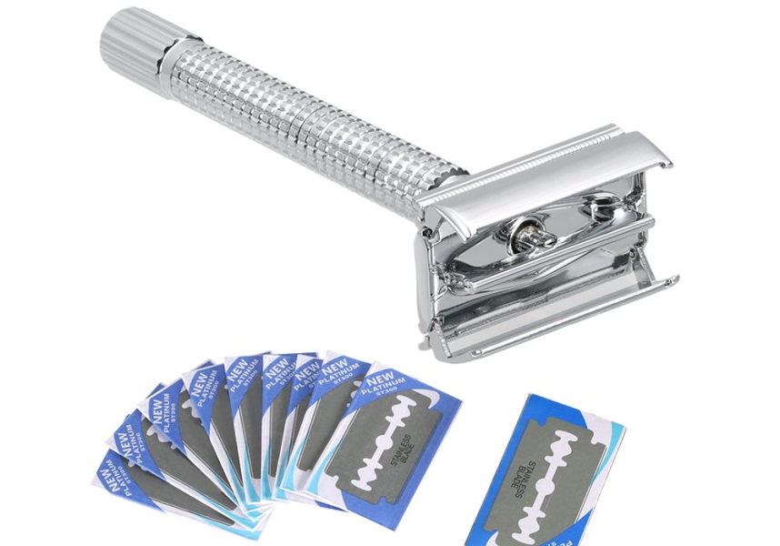
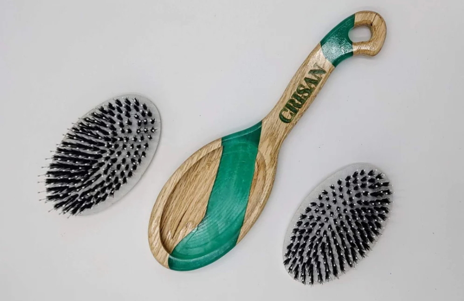
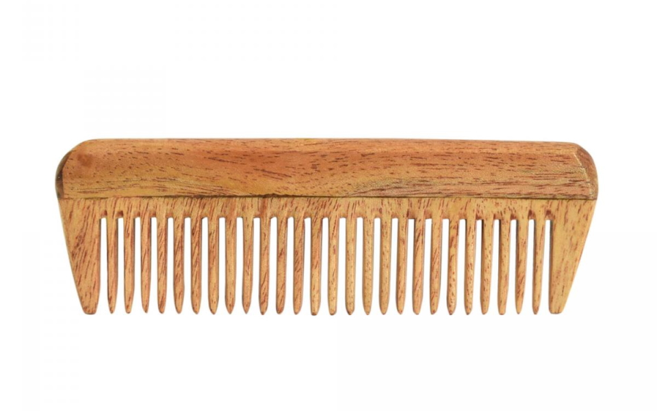
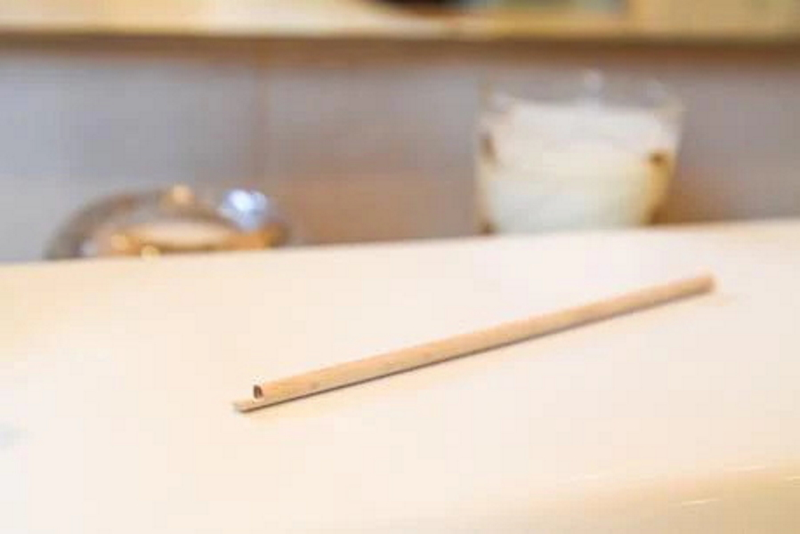

Bathroom
=====

Toothbrush
----------------
A really simple good first step for me can be switch from a classical toothbrush in end of life to an interchangeable head toothbrush.

Toothpaste
----------------
I know two possibility for the toothpaste the first is to simply buy some toothpaste tablets that can be sold in bulk or you can cook a tooth paste (there are a lot of recipes easily found online).

Shower mat
----------------
Yes it is possible to reduce your production of waste with a shower mat !
How it's possible ? By creating it with some wine cork !

Shampoo - Conditioner - Shaving cream - Lotion - Hand soap - Deodorant
----------------
Mhm, I know it's really hard for some people to understand, but there is one thing that can replace a shampoo,a conditioner, a deodorant, a hand soap, a shaving cream and a lotion and that's the famous Marseille soap ( or another soap, but I'm French so in my country a lot of people say the best comes from Marseille, but I don't know).

Razor
----------------
Oh you are very lucky for the Razor you can choose between two solutions :

The straight razor that i personnalise use because it's a 100% zero waste solution because you can sharpened the blade instead of throwing it away.

A metal safety razor, you need to change his blade but it's a really good solution.

Hairbrush / Comb
----------------
As you have seen before, objects with an interchangeable part are a good way to reduce waste.

But the best way is still to use a wooden comb that can be used for a century without any problem.

Toilet paper
----------------
You can find many tutorials on the web for making your own washable toilet paper. Personally, I'm not sure if this is my priority, but do as you wish.

Toilet brush
----------------
Yes, it is possible to find a toilet brush that is more durable than what is usually used.
I present to you a toilet brush made in France, which is called "bbb La Brosse".
It is eco-designed and very hygienic, as its shape, inspired by tree leaves, prevents dirt from clinging.
WARNING: I have no stock market shares in this company.

Cotton swabs
----------------
A good solution to stop using cotton swabs and protect yourself from potential earplugs.

Tissue paper
----------------
A well-known solution to the tissue paper is its cotton equivalent, which can be washed.

