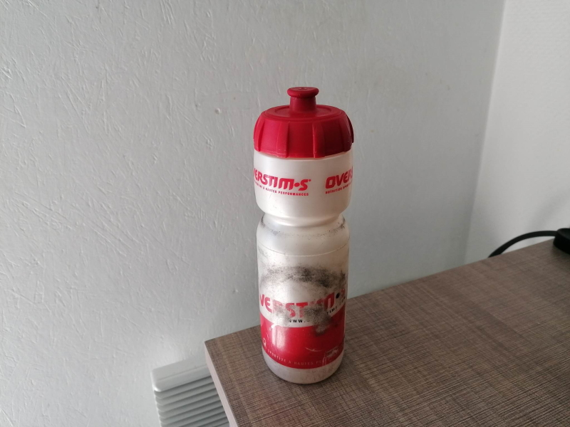

Kitchen
=====

Bottle of water
----------------
It's really common now to use now a stainless steel bottle instead of a regular plastic bottle, I think it's a better idea.
Personnaly, I prefer to use my cycling water bottle , but do as you want.

Food packaging
----------------
In order to reduce your waste, I advise you to buy them in bulk!
For that you need some things like reusables glass jars and reusable fabric produce bags.

Plastic wrap or aluminum foil
----------------
You can buy a beewrap or create it for replace your plastic wrap or aluminum foil.

Sponge
----------------
To replace your classic sponge, you can use a tawashi sponge made from recycled material (many tutorials are available online). With it, you don't need to buy a new sponge, because it's reusable.
As soon as your tawashi is dirty, machine wash it between 30 and 60°C.

Paper Towels
----------------
Yes, there is, you can create a DIY Unpaper Towels for replace your paper Towels.

.. image:: ../images/DIY_Unpaper_Towels.jpg
    :target: ../latest/_images/DIY_Unpaper_Towels.jpg

Salt/pepper grinder
----------------
A classical way to replace the salt grinder that you use and throw in the trash is to buy a more durable version.

Sachets de thé
----------------
A very simple problem to solve, buy your tea in bulk and use, stainless steel and reusable tea infuser

Dish brushes
----------------
And to finish with the kitchen, the ultimate step is switch from a classical dish brushes in end of life to an interchangeable head dish brushes.

